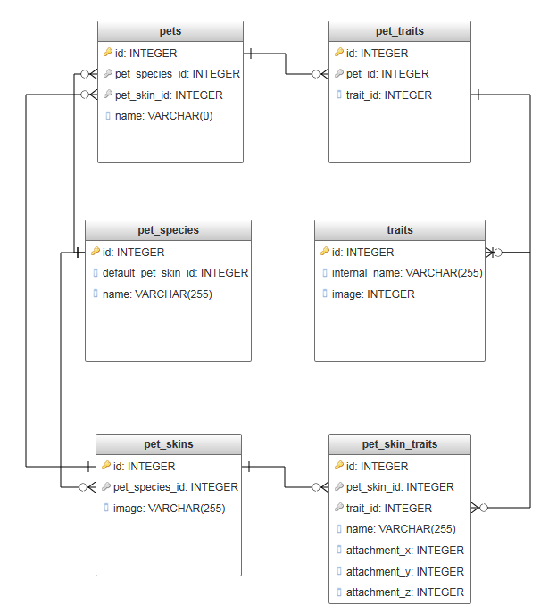

# Technical Architecture
## Overview
ZuttoPets is built from several distinct pieces:

- Relational database (Postgres)
- RESTful API (Lumen/PHP)
	- SparkPost for emails (via REST)
	- Undetermined thing for queuing (probably redis?)
- Progressive web app frontend (Vue.js)
	- Bootstrap 4
- NodeBB (Express/node.js)
	- Zutto SSO shim (node.js)
- Webserver terminating HTTPS (Apache -- does it support http/2?)

All of these components are open-source projects that will be open & free for anyone to examine, customize, or deploy.

## Major Topics
### Authentication
### Forum Integration
### Roll Tables
Roll tables will drive all of the RNG decisions. The tables can be configured and reused, and the individual tiers can also be reused across tables or within the same table.

[todo insert ER diagram]

### Pet Traits
Pet traits can be shown visibly on the pet. For example, a 'Winged' trait may add some wings to the image. Instead of drawing a billion combinations of specie/skin/traits by hand, the system should be able to overlay traits onto the image.

This system would be an ideal candidate for existing as a standalone microservice. It would take in a skin image or URL (URL must be on a trusted domain list) and an array of traits with their image and attachment points.

It's likely a lot of pets will have the same configurations, so caching the response would be very effective here.

The stand-alone nature of this service would also make it easy for other projects to reuse it or for us to demo it during a preview phase.

#### Database
To store this data and accomodate the skin system, we'll need to break the data storage up a bit:

A single 'trait' will correspond to one piece of artwork. To be available, it must be mapped onto each pet skin through the `pet_skin_traits` table, which will contain the X/Y coordinates for attaching it. This same table will track z-index so we can resolve layering conflicts.

The same system can be used for player characters. The `pet_skin_traits` table may need to be either generic (along with `pet_skins`?), or we just make a separate `character_skin_traits` table with similar rows.

#### Generating the Image
As far as generating the images goes, there are two options I want to explore (and yes, this plays into the eternal [raster vs vector](https://designshack.net/articles/layouts/vector-vs-raster-what-do-i-use/) struggle)

1. Typically, people just merge raster images together with Imagick server-side.
1. A more mobile-friendly solution may instead be merging SVGs together. This can potentially be done client-side.

The benefit of the second option is that, since we're going to be offering a VN-like NPC dialogue screen, SVGs will magically scale appropriately for whatever device/screen resolution the user has (being vector images and all). Merging these client-side should be fairly trivial as well (although I am not sure that's the best approach).

The second perk to SVGs is merging probably won't harm animations. I'm not sure how well merging animated traits onto an animated pet skin would work with raster images -- I assume we'd have to go frame-by-frame? -- whereas with SVGs, each should be able to have its own little javascript snippet providing animations.

The downside to the SVG approach is that we'll be using SVGs. Not having any appreciable artistic skills, I have no idea how the tooling (Photoshop/Sai/etc) will handle this stuff. If an artist likes Photoshop, does it have an easy way to turn their (presumably raster) image into a vector when saving? (Is that what Illustrator is for?)

If we do want to do animated skins and/or traits, does the tooling make it easy for artists to do this? I know things can be animated by adding javascript into the SVG, but artists aren't going to approach this like a programmer would.

If the tooling for artists to make SVGs is too complicated or limiting, we can do raster images instead, and have the addition of SVG handling as a post-1.0 feature.

With the raster image approach, the microservice will also need to take in a scaling factor or viewport resolution so it can scale the image to an appropriate size for the user's device. This would make the caching layer a bit less effective.

## Server
- backups
- load balance/redundancy
- notes on moving to AWS?
